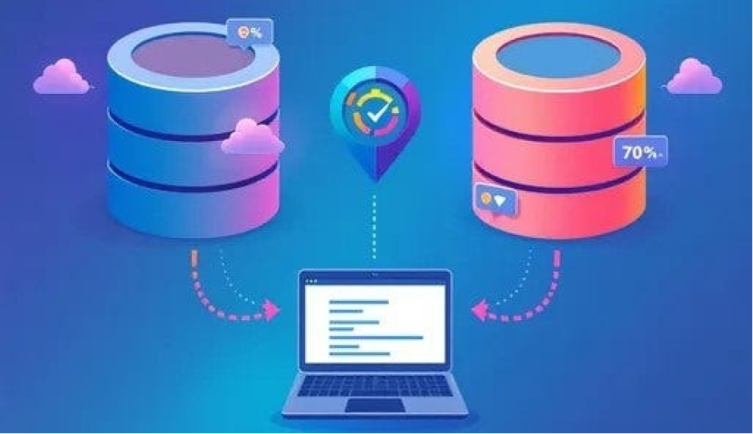

# jdbmig - Small, Smart, Database Migration utiility 



> Effortless Database Migration with jdbmig: A User-Friendly Approach

## Introduction

Migrating data between different database systems can be challenging, especially when handling schema differences and data type mismatches. **jdbmig** is a lightweight and user-friendly Java application designed to streamline database migrations using JDBC.

Whether you're moving from MySQL to PostgreSQL, SQLite to MariaDB, or any other JDBC-supported database, jdbmig simplifies the process for you.

---

## Why jdbmig?

- **Ease of Use**: Minimal configuration required — just set up a JSON configuration file and execute the migration.
- **Broad Compatibility**: Supports any database with a JDBC driver (MySQL, PostgreSQL, SQLite, MariaDB, Oracle, and more).
- **Minimal Setup**: Lightweight Java application with no complex dependencies.

---

## Quick Start (No Source Code Needed)

### 1. Download the Distribution Package
- Go to the `dist` directory in this repository.
- Download the `JDBMig.jar` file.

### 2. Prepare the Configuration File
- Create a JSON configuration file specifying your source and target database connection details, tables to migrate, and other settings.
- See `dist/config/config.json.EXAMPLE` for a complete example and documentation of all configuration keys.

### 3. Execute the Migration

**Export data:**
```bash
java -jar JDBMig.jar --export --config config/config.json --dataDir /path/to/exported/data
```
**Import data:**
```bash
java -jar JDBMig.jar --import --config config/config.json --dataDir /path/to/exported/data
```

- `--export`: Export data from the source database to JSON files.
- `--import`: Import data from JSON files into the target database.
- `--config`: Path to your configuration file.
- `--dataDir`: Directory to store/read exported JSON files.
- `--useConn`: Specifies which connection to use if multiple are defined.

> This approach lets you perform migrations effortlessly—no need to interact with the source code!

---

## Configuration Example

See [`docs/jdbmig2.pdf`](docs/jdbmig2.pdf) for detailed documentation and example configurations.

Basic structure of the config file:
```json
{
  "dataDir": "data/",
  "fieldToLowerCase": false,
  "prettyPrint": false,
  "useConn": "SQLITE_connection",
  "tables": ["table1", "table2"],
  "MYSQL_connection": {
    "type": "mysql",
    "initString": null,
    "jdbcUrl": "jdbc:mysql://localhost:3306/DATABASE_NAME",
    "user": "user",
    "password": "password"
  },
  "drivers": [
    {"name": "mysql", "className": "com.mysql.jdbc.Driver", "jarFile": "lib/mysql-5.1.18.jar"},
    {"name": "postgres", "className": "org.postgresql.Driver", "jarFile": "lib/pgsql-42.2.15.jar"}
  ]
}
```
- Additional options: `prettyPrint`, `fieldToLowerCase`, `beforeExecute`, `afterExecute` (run SQL scripts before/after import/export).
- See the example config and the PDF for more advanced usage (multiple connections, driver management, Oracle/Postgres/SQLite setups).

---

## Limitations

- At this time, only data import is supported; the target database schema must already exist.
- See the PDF for more advanced use-cases and limitations.

---

## Source Code Insights

- The `java/` folder contains the NetBeans + Ant-based source code.
- Key classes:
  - **JDBMig.java**: Entry point, handles command-line parsing.
  - **Export.java**: Manages data extraction and serialization.
  - **Import.java**: Handles data import and type mapping.
  - **DynamicConnect.java** / **DynamicDriver.java**: JDBC driver and connection abstraction.
- Utility classes ensure JSON compatibility for blobs, dates, timestamps, etc.

> Developers can extend jdbmig, e.g., to automate schema creation on import.

---

## Documentation

- [📄 Full PDF Documentation](docs/jdbmig2.pdf)
- Example config files in `dist/config/`

---

## How to Contribute

1. Fork the repository
2. Create a branch for your changes
3. Open a Pull Request!
4. Issues and feature requests are welcome.

---

## License

This project is licensed under the MIT License.

---

**Contact**  
If you want to discuss implementation, technical aspects, or propose improvements, feel free to open an issue or contact me!

---

Give jdbmig a try and start migrating your databases the easy way!
